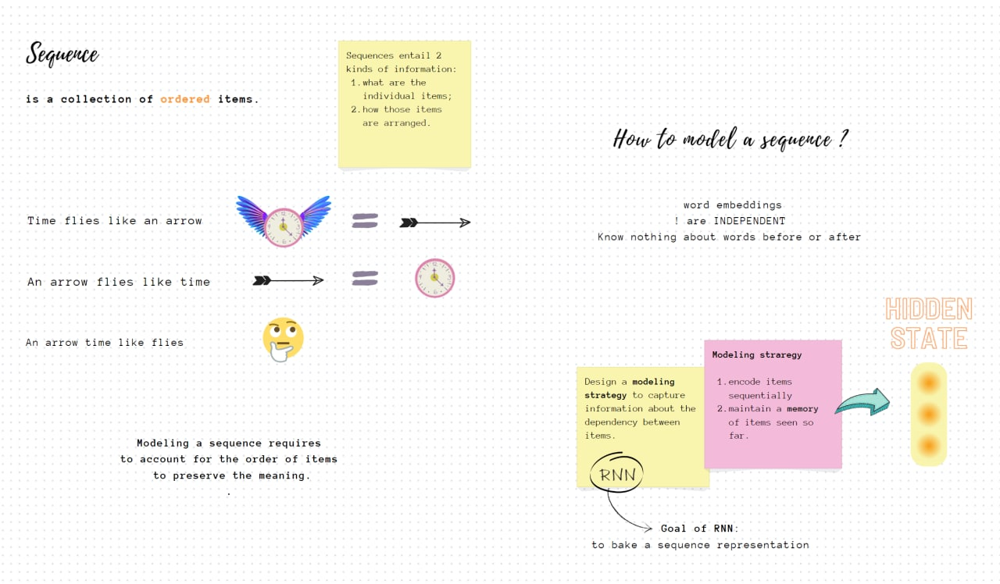

# Sequence Modeling

  

Here you can find some awesome materials that will show you the easy way to model sequences, the kind of linguistic data where the order matters.

You will become familiar with neural models excelling in sequence modeling task: Recurrent Neural Networks.
Our goal is to give you insights into RNNs working mechanism, and illustrate their power with two practical applications:

First, we shall revise the Yelp Restaurant Reviews from the previous class, to try out recurrent neural networks in an already familiar classification setting.

In [**Shakespear_Alive!.ipynb**](./Shakespear_Alive!.ipynb) we switch to a new task of text generation, and bring to live characters from the most notable Shakespeare's plays. The notebook will teach you the "noble art" of language modeling, comparing classical and Neural approaches on Shakespearean style writing.
